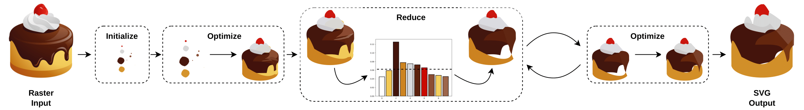

# Optimize and Reduce: A Top-Down Approach for Image Vectorization

[](https://pytorch.org/)
[](https://github.com/zjukg/DUET/blob/main/licence)
[](https://aaai.org/Conferences/AAAI-24/)


 ## 🔔 News
- **`2023-12`** Our paper: Optimize and Reduce: A Top-Down Approach for Image Vectorization was accepted by **`AAAI 2024`**


We propose Optimize & Reduce (O&R), a top-down approach to vectorization that is both fast and domain-agnostic. O&R aims to attain a *compact* representation of input images by iteratively optimizing Bézier curve parameters and significantly reducing the number of shapes, using a devised importance measure.



By [Or Hirschorn*](https://scholar.google.co.il/citations?user=GgFuT_QAAAAJ&hl=iw&oi=ao), [Amir Jevnisek*](https://scholar.google.com/citations?user=czm6bkUAAAAJ&hl=en&oi=ao), and [Shai Avidan](https://scholar.google.co.il/citations?hl=iw&user=hpItE1QAAAAJ)

Where * denotes equal contribution.

## 📕 Setup
```shell
cd docker
docker build -t optimize_and_reduce_aaai .
cd ..
docker run -v $(pwd):/home/code -it optimize_and_reduce_aaai /bin/bash
```


## 🚀 Run
1) Running O&R:

```shell
python reduce_or_add_and_optimize.py --target target_images/083.png \
  --scheduler  256 128 64  --num_iter  100 100 100 \
   --recons_loss_type l1_and_clip_mix  --l1_and_clip_alpha 0.95  \
  --geometric_loss_type geometric --ranking_loss_type mse      \
  --canvas_width 256 --canvas_height 256  --advanced_logging
```
2) Running the baseline DiffVG:
```shell
python basic_diffvg.py --target target_images/083.png \
  --num_paths 64       --num_epochs 1 --num_iter 400 \
  --recons_loss_type l1       --geometric_loss_type none \
  --canvas_width 256       --canvas_height 256 --scheduler 400 \
  --init_type random
``` 

## 📚 Dataset Download
1. [Old Emojis](https://github.com/googlefonts/noto-emoji/releases/tag/v2015-09-29-license-apache), take the images from [this](datasets/datasets_metadata/old_emojis_list) list
2. [New Emojis](https://github.com/googlefonts/noto-emoji/tree/main/png), take the images from [this](datasets/datasets_metadata/new_emojis_list) list
3. [Free-SVG](datasets/from-free-svg.zip)
4. [NFT-Apes](datasets/nft-apes.zip)
5. [Midjourney Images](https://drive.google.com/file/d/1U9Vjz5ULUzFE-ythlupVodYIp0E9AERC/view?usp=drive_link)


## 🌈 Cite:
Please consider citing this paper if you found the ```code``` or ```data``` useful.

```bigquery
@inproceedings{DBLP:conf/aaai/OptimizeReduce,
  author       = {Or Hirchorn and
                  Amir Jevnisek and
                  Shai Avidan},
  title        = {Optimize and Reduce: A Top-Down Approach for Image Vectorization},
  booktitle    = {{AAAI}},
  publisher    = {{AAAI} Press},
  year         = {2024}
}